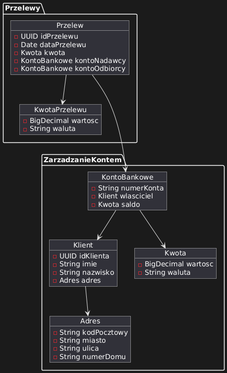

# Zadanie 1

## Modelowanie Agregatów, Encji i Obiektów Wartości

Celem zadania było stworzenie modelu fragmentu systemu bankowego, zgodnie z zasadami Domain Driven Design (DDD). W projekcie zdefiniowano 2 konteksty: Zarządadzanie Kontem oraz Przelewy. Zdefiniowano również przyjęte założenia.

## Zdefiniowanie przyjętych założeń

| Encja/Obiekt | Atrybuty | Założenia i Opis |
|--------------|----------|------------------|
| **Przelew** | `idPrzelewu`, `dataPrzelewu`, `kwota`, `kontoNadawcy`, `kontoOdbiorcy` | Przelewy są realizowane tylko przy wystarczającym saldzie, zapisują datę realizacji. |
| **KwotaPrzelewu** | `wartosc`, `waluta` | Reprezentuje wartości pieniężne, obsługuje formaty i waluty zgodnie ze standardami. |
| **KontoBankowe** | `numerKonta`, `wlasciciel`, `saldo` | Numer konta unikalny (standard IBAN) |
| **Klient** | `idKlienta`, `imie`, `nazwisko`, `adres` | Klient ma unikalne ID, imie i nazwisko zawierają limit znaków, składają się tylko z liter |
| **Adres** | `kodPocztowy`, `miasto`, `ulica`, `numerDomu` | KodPocztowy (^\d\d-\d\d\d\$), miasto z bazy miast, ulica opcjonalna z bazy ulic, numerDomu (^\d+[a-z]\*$)|
| **Kwota** | `wartosc`, `waluta` | Reprezentuje wartości pieniężne, obsługuje formaty i waluty zgodnie ze standardami. |

- **Przelew** łączy operacyjnie dwa konta, pobierając środki z jednego i przekazując na drugie.
- **Klient** zarządza swoimi danymi osobowymi, które są powiązane z kontem.
- **Adres** służy jako informacja dodatkowa w danych klienta.
